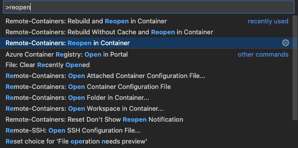

#  Pre-Requires
  
* **docker** (you must add group for no sudo) and **docker-compose**
  * https://docs.docker.com/engine/install/ubuntu/#install-using-the-convenience-script
* vscode (extension id)
  * ms-vscode-remote.vscode-remote-extensionpack
  * ms-azuretools.vscode-docker
* j-link
  * https://www.segger.com/downloads/jlink/
  
#  Reopen in Container
  
If you are ready above the requires, press F1 key and enter keyword 'reopen'
  
so you can see 'Remote Containers: Reopen in container'
  
Just click!
  

  
###  Notice
  
On linux, it may very slow that build environment is ready
  
because uid,gid of user inside the docker image changes
  
to uid,gid of host
(uid and gid of user inside the docker image is each 1000)
  
#  Getting Started
  
  
###  Build Command
  
west build -p always -b raytac_mdbt50q_db_40_nrf52840
  
###  Binary path
  
{project_root}/build/zephyr/zephyr.hex
  
###  API reference
  
https://docs.zephyrproject.org/latest/index.html

---

## Program and Debugging

The program uses j-Flash Lite, and debug logging uses j-link RTT view because there is no uart line.

---
